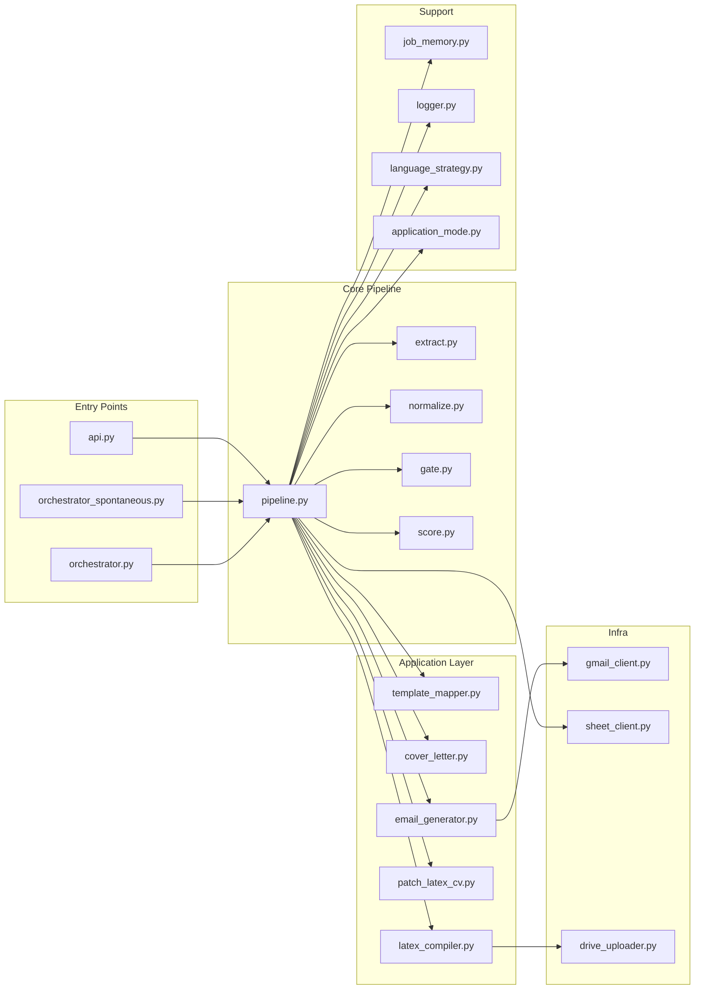

# Quant Job Optimization Engine (QJOE)

## Overview

Deterministic system to filter, score, and generate applications for quant roles.

No LLM in decision. No automation without validation. Full control.

⚠️ No application is ever sent automatically. Human validation is mandatory.

---
## System Architecture

## Core Principles

- 100% deterministic pipeline  
- No LLM in decision-making  
- No hallucination (missing data → null)  
- Human-in-the-loop mandatory  
- Robustness over complexity  

---

## Pipeline

COLLECT → EXTRACT → NORMALIZE → GATE → SCORE → GENERATE → VALIDATE → TRACK

---

## What It Does

- Extracts structured data from job offers  
- Filters out irrelevant roles (reporting-heavy, non-quant, etc.)  
- Scores opportunities (0–100, deterministic)  
- Generates CV + email automatically  
- Prepares drafts (no auto-send)  
- Tracks results for optimization  

---

## Decision Rule

- Score ≥ 50 → GREEN  
- Score < 50 → RED  

No override. No grey zone.

---

## Tech Stack

Python (FastAPI) • Google Sheets • Gmail API • VPS  

---

## Status

- End-to-end pipeline operational  
- Deterministic scoring implemented  
- Application generation functional  
- Manual validation workflow active  

---

## Why QJOE

Most job application tools rely on AI, leading to inconsistent and opaque decisions.

QJOE ensures:
- transparency  
- reproducibility  
- strategic control  

---

## Author

Quantitative Finance — Market Risk, Quant Risk, Derivatives
